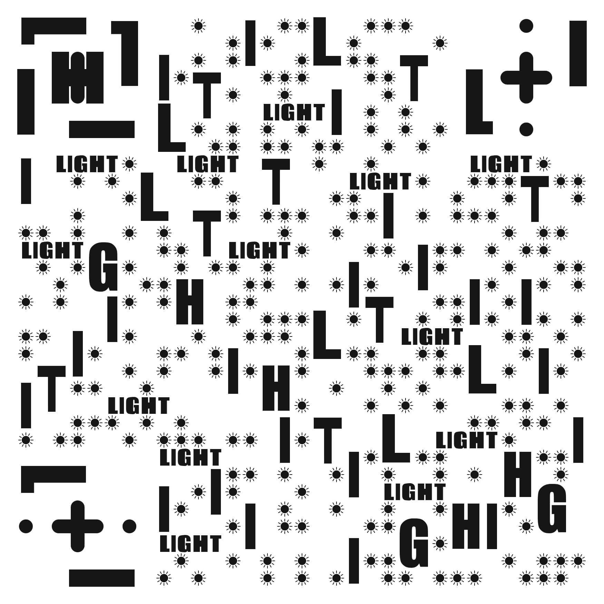
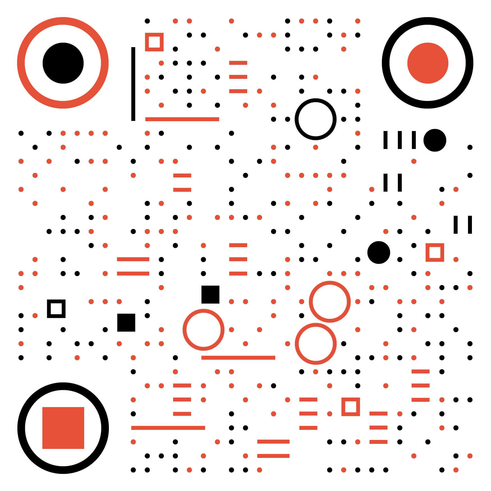

# 「BOX 定投践行群」入群指南

## 「BOX 定投践行群」群到底是啥？
2019年7月底，笑来老师着手成立了一个名为 **BOX 定投践行群** 的投资社群。迄今为止，社群人数已经突破4000人，在可预期的未来，社群的规模还会不断的壮大。

**这是地球上第一个，也是唯一一个，拥有 0管理费 和 0开润(抽成) EFT基金的投资社群** —— 没错，就是BOX 定投践行群！

## 重新定义「BOX 定投践行群」

- 由[李笑来]([https://zh.wikipedia.org/wiki/%E6%9D%8E%E7%AC%91%E6%9D%A5](https://zh.wikipedia.org/wiki/李笑来))发起，汇聚超过 `4000` 名成员的投资社群；

- 这是世界上第一个，也是唯一一个拥有 **社群基金** 的投资社群；

- 该社群的投资标的是一个叫做 `BOX` 的 **0 管理费、0开润(carry)** 的社区 [ETF基金]([https://zh.wikipedia.org/wiki/%E4%BA%A4%E6%98%93%E5%9E%8B%E5%BC%80%E6%94%BE%E5%BC%8F%E6%8C%87%E6%95%B0%E5%9F%BA%E9%87%91](https://zh.wikipedia.org/wiki/交易型开放式指数基金))；

- `BOX` 同样也是 「BOX定投践行群成员」的 **股份**；

## 「BOX」 的名字由来

`BOX` 这个名字其实来源于 `BTC`、`EOS`、`XIN` 三个数字资产的缩写，将这三个标的按照一定的比例，放入一个ETF基金中，取名为 `BOX`(更多关于BOX的信息，可以详细阅读 [《定投改变命运》](https://ri.firesbox.com/#/) 一书中的 [BOX详细介绍](https://ri.firesbox.com/#/cn/?id=_1-%e5%85%b3%e4%ba%8e-box) 一节)。

## 加入 「BOX 定投践行群」给我带来什么

1. 长期地定投 `BOX` 这个未来可能有很高回报的标的，在未来的某一天实现 **财富自由**；

2. 在践行群内，笑来老师会不时的讲课，帮我们做好心理建设，无论涨跌都能捏住 `BOX` 不被震荡出局；

3. 除了笑来老师的课程之外，还有其他老师讲述 英语课、编程课、逻辑课、销售课 等课程；

4. 一个由一帮积极上进的人组成的社群，不仅是你可探索的人脉圈，更可能是你未来的合作伙伴；

5. 所有讲过的课程都有回放记录，有的课程甚至还有开源在github上的资料，比如 [逻辑课](https://github.com/liudawozhemebang/beyond-feelings)、[编程课](https://github.com/neolee/pilot)；

## 导航

### 1. [入群指南](https://github.com/BobbyLH/Guide-for-BOX-Regular-Investment-Group/tree/master/%E5%85%A5%E7%BE%A4%E6%8C%87%E5%8D%97)

### 2. [精彩课程一览](https://github.com/BobbyLH/Guide-for-BOX-Regular-Investment-Group/tree/master/%E5%85%A5%E7%BE%A4%E5%BF%85%E8%AF%BB%E4%B9%A6%E7%B1%8D)

### 3. [笑来书籍推荐](https://github.com/BobbyLH/Guide-for-BOX-Regular-Investment-Group/tree/master/%E7%AC%91%E6%9D%A5%E5%85%B6%E4%BB%96%E4%B9%A6%E7%B1%8D)

### 4. [笑来其他课程](https://github.com/BobbyLH/Guide-for-BOX-Regular-Investment-Group/tree/master/%E7%AC%91%E6%9D%A5%E5%85%B6%E4%BB%96%E8%AF%BE%E7%A8%8B)

### 5. [联系我](https://github.com/BobbyLH/Guide-for-BOX-Regular-Investment-Group/tree/master/%E8%81%94%E7%B3%BB%E6%88%91)

## 联系我
结交新朋友一直是一件很快乐的事情，尤其是我们之间有相同的目标和兴趣的时候。

### 微信：
微信号：`bobby_lh`

二维码：

 

### Mixin:
Mixin号：`37354027`

二维码：

 