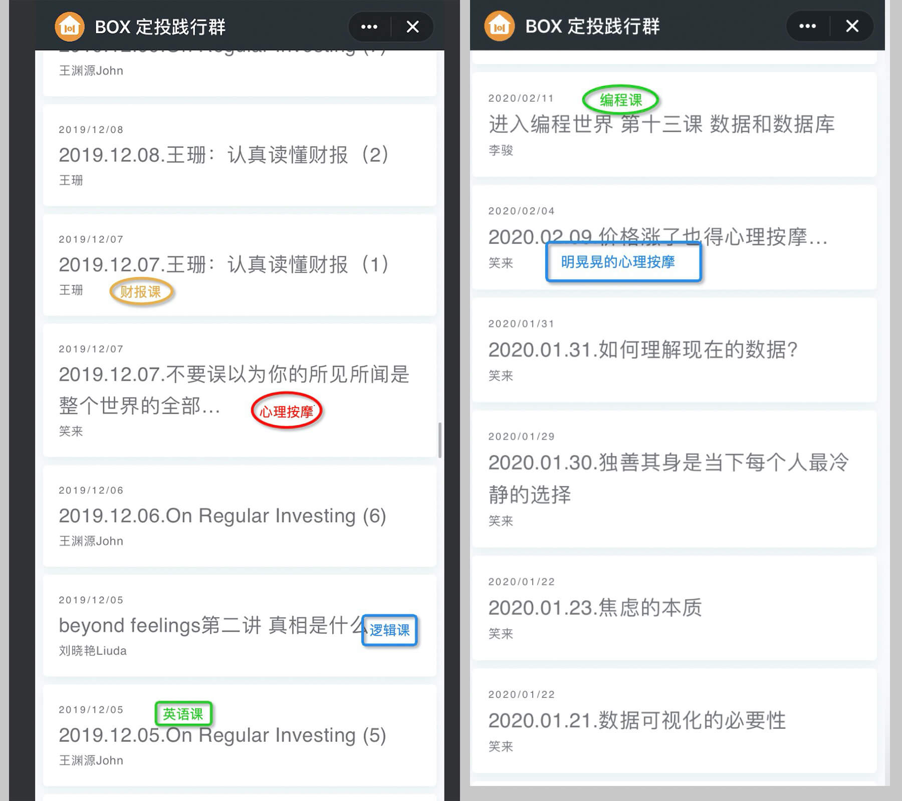

# 定投践行群入群指南

## 定投践行群到底是啥？
2019年7月底，笑来老师着手成立了一个名为 **BOX 定投践行群**。迄今为止，社群人数已经突破4000人，而更让人惊讶的是加入这个群的入群费并不低 —— 需要支付等价于 2020.73 人民币的BTC(比特币)，除此之外，还需要群内的人提供邀请码。

为什么要叫 `BOX` 定投践行群呢？这个 `BOX` 到底是什么？这个名字其实来源于 `BTC`、`EOS`、`XIN` 三个数字资产的缩写，将这三个标的按照一定的比例，放入一个ETF基金中，取名为 `BOX`(更多关于BOX的信息，可以详细阅读 [定投改变命运](https://ri.firesbox.com/#/) 一书中的 [BOX详细介绍](https://ri.firesbox.com/#/cn/?id=_1-%e5%85%b3%e4%ba%8e-box) 一节)。

## 为什么我要加入践行群
先来看看 **账面** 上的好处：
  1. 所有 BOX 的赎回交易(即将其兑换成篮子内的数字资产)所产生的手续费都会按照一定比例进行分红，对象自然是践行群的成员；
  
  2. BOX 中的 `XIN` 可以创建公共节点，而这个节点所产生的收益也会按照比例，进行年度分红，对象当然也是践行群的成员；

  3. 更为关键的是，所有加入践行群的成员都有出售践行群门票的资格，并且能够获得出售门票的提成(25%)，这是你用来提升自己场外赚钱能力的一个不错的途径；

  4. 除此之外，笑来老师会提供很多销售标的给践行群的成员，每次成功的销售都会有提成，而这些源源不断的资金，未来有一天会以10倍，甚至100倍的收益落入你的账户中，帮你真正实现财富自由。

除了肉眼可见的收益，你还能获得 **终生受用的财富**：
  1. 除了笑来老师在践行群里时常为我们做心理建设，帮助我们克服[Siren的歌声](https://github.com/xiaolai/regular-investing-in-box/tree/8fa47822248624acffcdb42a7b8f2ef08338e60d/docs/cn#%E5%89%8D%E8%A8%80)之外，还有诸如英语课、编程课、逻辑课、销售课、写作课等课程，这些老师用他们专业的知识为你解惑答疑，帮你掌握这些未来可能创造巨额财富的基本能力(所有讲过的课程都有回放记录，有的课程甚至还有开源在github上的资料，比如[逻辑课](https://github.com/liudawozhemebang/beyond-feelings)、[编程课](https://github.com/neolee/pilot))；

  

  2. 除了定投的BOX在未来会变成一笔不菲的财富之外，你还会明白生命中无处不定投的道理 —— 定投你的亲情、友情，让你的幸福感更高；定投你的健康，让你拥有强健的体魄；定投学习、工作，让你被更多人需要，更值钱……这些东西远比金钱重要的多，因为它们是在你财富自由之后，让你获得支配这些财富，所需要的智慧的必要条件；

  3. 那么多的战友，强大的社群力量团结在一起，让你知道你不是一个人在战斗 —— 无论是发个红包兜售你的好东西，还是分享你自己的内容创作，在这里你大概率收获的是鼓励的声音、支持的行动，有还比这更有趣的事情么？

## 如何加入定投践行群

## 附录
### 如何购买你的第一笔数字资产

### Mixin 安装指南

### 科学上网小指北

### 我们一起定投吧？！战友