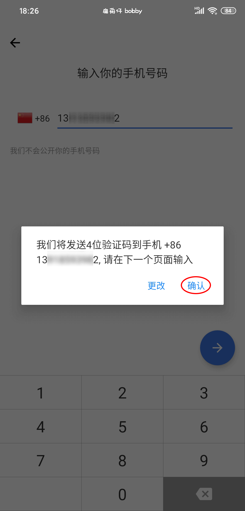

# 「Mixin」的下载和注册

## 下载 Mixin

> 手机移动端：
> - 国内通用链接 https://a.app.qq.com/o/simple.jsp?pkgname=one.mixin.messenger
> - 注：iOS 完整版需要非中国区 Apple ID 下载

> 电脑桌面端：
> - 用浏览器打开 https://mixin.one/messenger

## 注册 Mixin

1. 打开 Mixin，点击同意并继续

    

2. 输入手机号码，点击右下方的蓝色箭头，在弹出的提示框中点击 【确认】按钮

    

3. 输入接收到的验证码

    

4. 填写 **昵称**，注册成功

    

