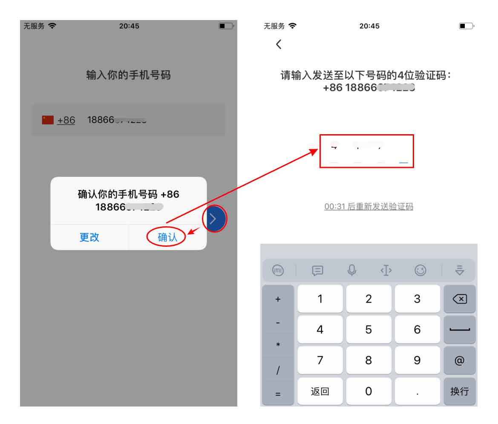
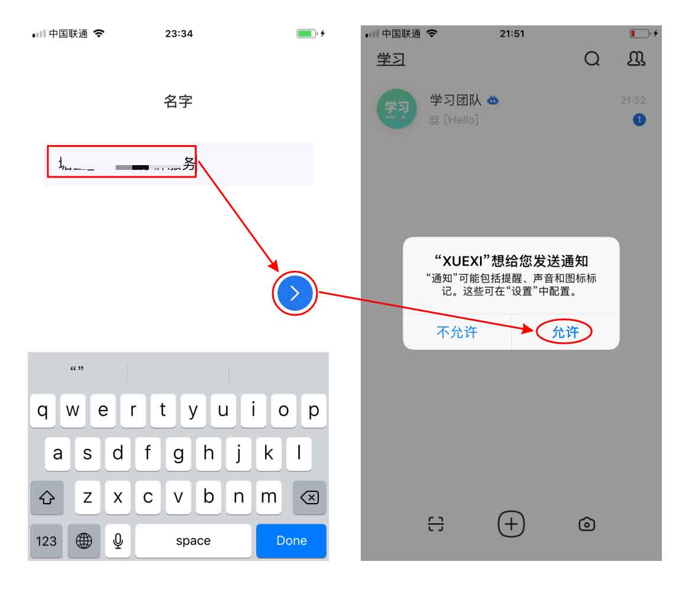

# 「新生大讲堂」下载和注册

## 下载 新生App

> 手机移动端：
> - 请在手机浏览器中直接打开 https://www.firesbox.com/app/
> - 根据你的机型，选择对应的版本

> 电脑桌面端：
> - 用浏览器打开 https://mixin.one/messenger

## 注册 新生App

1. 打开「新生大讲堂」，输入手机号，点击【确认】，再输入收到的4位验证码

    

2. 填写昵称，然后点击进入首页，即注册成功

    

