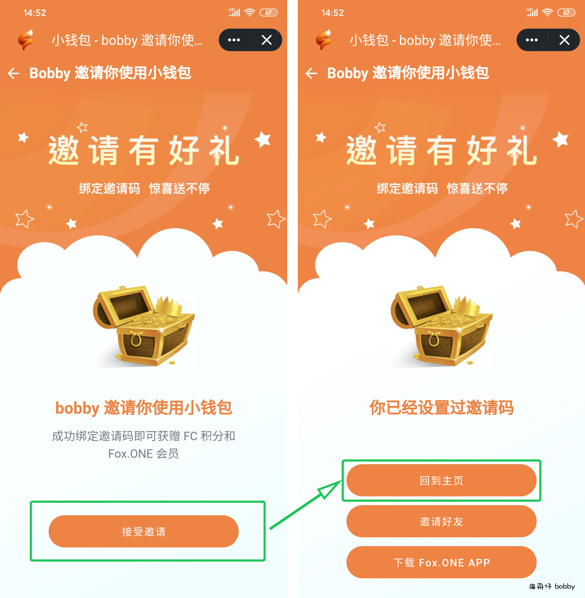
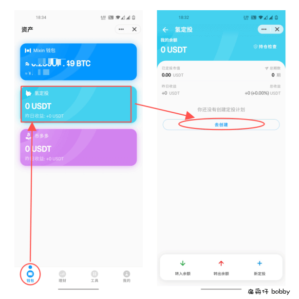
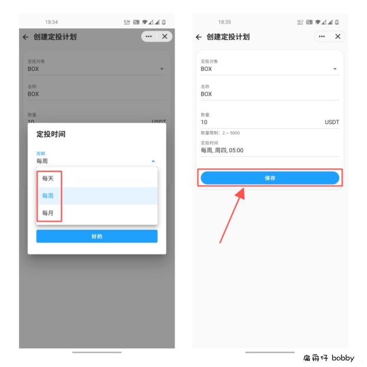
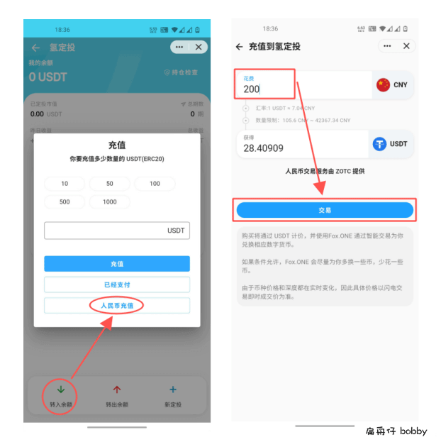
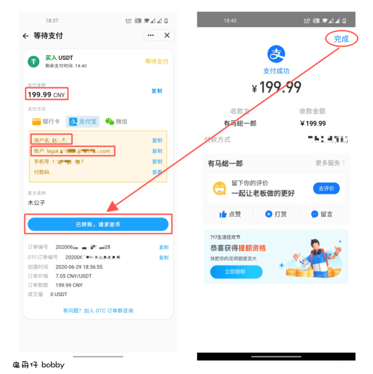
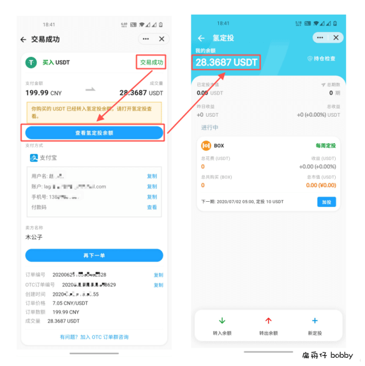

# 开启「BOX」定投
我们通常都使用 **小钱包** 管理自己的数字资产，因为小钱包不仅可以买卖比特币、验证资产、还有定投等很多功能。

使用步骤具体如下：

## 步骤1 - 开小钱包
1. 先用 **Mixin** 扫描下面这个二维码打开小钱包：

  

2. 点击【**接受邀请**】—->【**回到主页**】，成功绑定后可获赠FC积分和Fox.ONE会员，可用于Fox.ONE各项奖励活动

  

## 步骤2 - 创建定投
1. 在小钱包中点击【**钱包**】—【**氢定投**】—【**去创建**】

  

2. 选择 **定投对象、名称、数量**，根据你的实际情况，设置按 **每天**、**每周** 或 **每月** 自动扣款，然后点击【**保存**】

  

**注意**：氢定投按照USDT来扣款，**1USDT=1美元**

## 步骤3 - 充值
1. 如果余额不足，请先充值，点击【**转入余额**】—【**人民币充值**】，输入你想充值的金额，点击【**交易**】

  

2. 选择你 **最熟悉的支付方式**，复制**用户名、账户、支付金额**，然后打开**对应的支付APP**给卖方转账，转账成功再点击【***已转账，请求放币**】

**请注意**：一定要先给卖方转账，再点【**已转账，请求放币**】，转账时请**不要备注任何信息**！

  

3. 稍等5-15分钟，右上角提示【**交易成功**】，再点击【**查看氢定投余额**】，就可以看到刚买入的USDT啦！

  

综上，定投计划就设置好了，到期会自动扣款定投，省时省心！