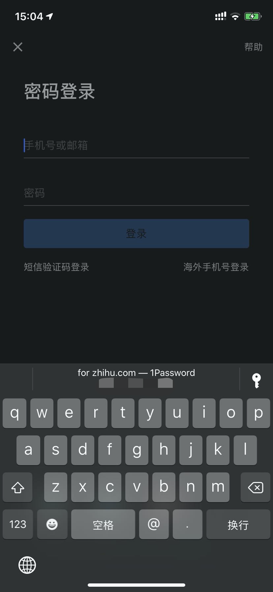
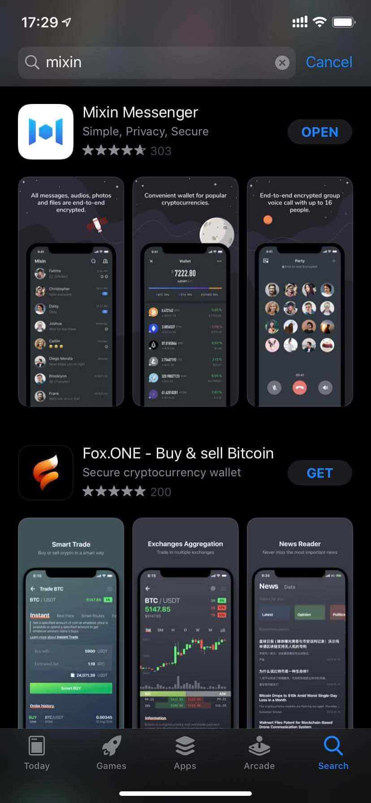
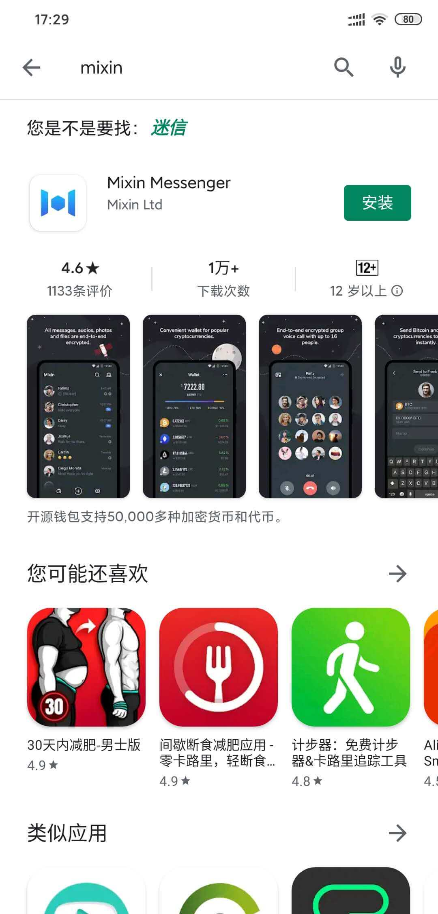

## 数字时代的必备武器

1. 教会你搭建 自己的 vps 服务 「或」 组建一台能 够畅游全球互联网 的路由器；
    - 这也许是你开始进入编程世界的起点 —— 用代码解决一个现实生活中的实际问题；

    - 或是有一台能够全家共享的路由器，从一开始让全家人都就选对了遨游世界的工具 —— Google 而不是 百度

2. 教你学会「1password 密码管理软件」，为你的数字资产保驾护航；
    - 只需一个密码，就能管理其他所有的密码！安全、方便，你值得拥有！

    

3. 教你搞定 IOS 美国区 Apple 账号 的注册 或 Andriod Google 账号 的注册
    - 好处是可以下载各种海外版应用，就比如带钱包的 mixin：

    
    

4. 提供 境外开卡 的经验分享
    - 一套成功申请到 velo 的 checking 账户和借记卡的经历，包括借记卡被盗刷后如何申述的过程；

    - 对比其他地域的开户条件，帮你选出适合自己的境外开卡银行；