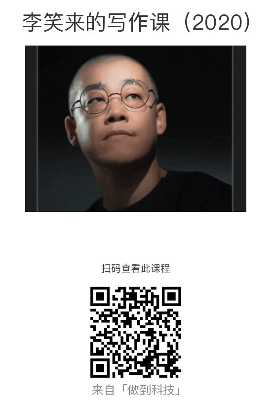

# 笑来写作课

无论是我们熟知的《把时间当做朋友》、《通往财富自由之路》、《定投改变命运》，亦或是十几年前出版的《TOEFL核心词汇21天突破》，笑来老师的在文字上的创作能力都是摆在那儿，毋庸置疑的。“不仅畅销，而且还长销” —— 这是他给自己的作品定制的基本原则，做不到这一点，也没必要创作。

而且，在时间慢慢流逝的过程中，笑来老师的创作能力也在同步提升。和二十多年前，他发表在自己博客上的文字比起来，现在他出版的作品，不再是 “干巴巴的没有生气的文字描述”。一个概念或一个感知，或许你早就知晓或是观察到，但就是没办法像他一样，用一段或几段文字就表达的清清楚楚，就好像它们原本是你想要说的话一样，只不过经过了笑来老师的手，递到了你的眼前。

**写作的本质，就是向受众表达你的感知的过程** —— 这是我学习写作课后的一个感悟。

“写作嘛，谁不会呢？！” 

我原本也这么认为：从小学开始，经过初中、高中、大学，外带一个论文答辩，我以为我已经是 “身经百战”，虽然做不到 “信手拈来”，但至少也能 “下笔如有神” 吧？

但某天，自己想向朋友描述某个电影的一个桥段，以此来证明这部电影真的很精彩时，自己说着说着就发现，自己表达的内容完全不着调。朋友更是听的一头雾水，半响后，朋友回复说：“那我有空再看看吧”。要不是给我面子，估计已经扭头走了吧？

这谁受得了啊？回去后，我下决心要好好梳理这个影片的内容，然后用自认为 “有神” 的文字，把这个过程记录下来，心里想的是就算我说不清楚，至少还能写清楚吧？结果呢？结果是不到一刻钟，我就放弃了，原因有很多，最关键的一条是，我完全没有办法用文字清楚描述那部电影到底说了啥！

在这里我知道，想要写好这个写作课的销售文案本身就是很难的，因为若是我写的不好，那岂不是从侧面反映了至少在我身上，写作课并没有给我带来什么实质性的改变？就算写的还行，那也不能证明这就是写作课带来的收获。除非，我能够向你清楚的描述这样一个感知：**若你错过了写作课，你的生活也不会因此受到什么影响；但若是你真的报名了，而且亲自去实践过，你就会发现，有它和没它，差了真的不止一点点！**

第一期的课程报名已经结束，共计 `4500` 多人参加。下一轮预计会在 2020年9月份开放，届时扫码即可报名参加：

 