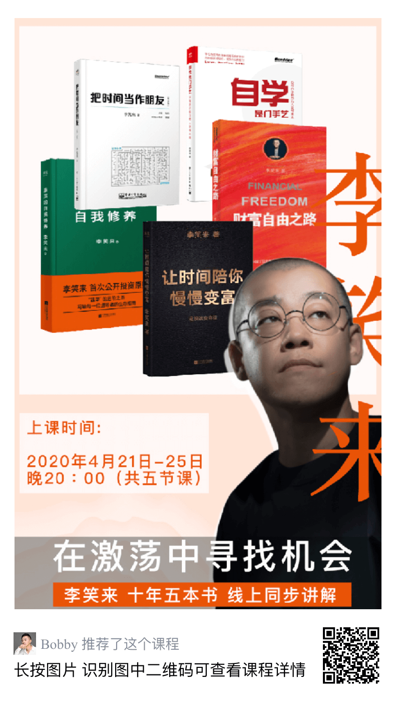

# 十年五本书

## 有哪五本书？

1. 《把时间当做朋友》

2. 《通往财富自由之路》

3. 《韭菜的自我修养》

4. 《自学是门手艺》

5. 《定投改变命运》

## 为什么我要听？

自身能力的提升是永远绕不开的话题，而单靠自己盲目的学习累积，远不如有一位名师指点来的容易，《十年五本书》—— 在激荡中寻找机会，笑来老师和你一起解读他十年的五本书，从《通往财富自由之路》到《让时间陪你慢慢变富》，都是让普通人超越阶层，实现财富自由的人生指南。

更为关键的是，笑来老师承诺 **这个系列的课程他会反复讲的**！！！

笑来老师如是说：

> 首先，我所分享的内容都是简单朴素的 —— 简单朴素到若非李笑来掏心掏肺地讲，大多数人会觉得它们是废话的地步：正如《把时间当作朋友》那本书里所描述的那样，“所谓的成功，无非就是用正确的方式做正确的事情……” 但，李笑来与其他作者略有不同的地方在于，他们的内容是写出来的，李笑来的内容是活出来的 —— 朴素与朴素之间也可能有着天壤之别。

> 其次，我并没有为这个课程定下一个 “特定的名称”，而是颇有些含混地将其命名为《十年五本书》，是有用意的。因为我的内容常常无法用一个简单的分类概括（所以，过去有过趣闻：《把时间当作朋友》被放在 “妇女之友” 分类之中 —— 也不知道为啥？）…… 可能会涉及的话题包括，学习、生活、写作、成长、个人品牌打造，甚至创业与投资等等。

> 最为重要的是，**这个系列的课程我会反复讲的**。每次讲过之后，我会抽时间反思总结，而后想办法改进。已经付费听讲的朋友，下一次重讲的时候，无需再次缴费。所以，这个系列的课程我是不会设置回放的。如果你觉得它重要，你不会错过（你会想尽一切办法）；如果你错过了，其实将来你也不会听回放的 —— 因为我会重新讲的，你会自然而然地听新版本……

## 如何加入？

非常简单，拿起你的手机，打开微信的 **扫一扫**，对准👇下图中的右下方二维码即可

  

59.9 嫌贵？一顿外卖的钱，就能够多让你明白哪怕一点点的东西，而这东西很可能会改变你的人生轨迹，你不妨再仔细想想到底贵么？